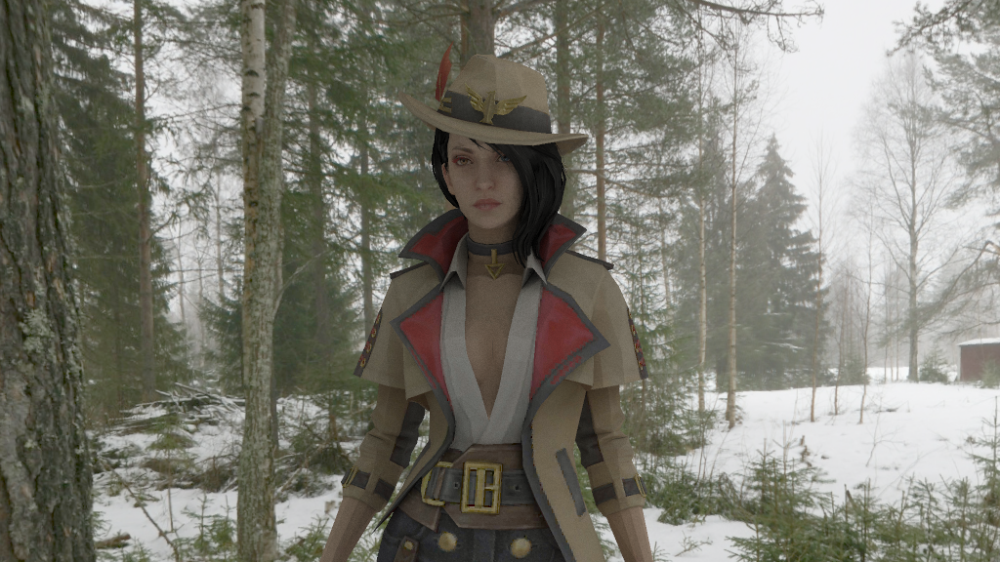
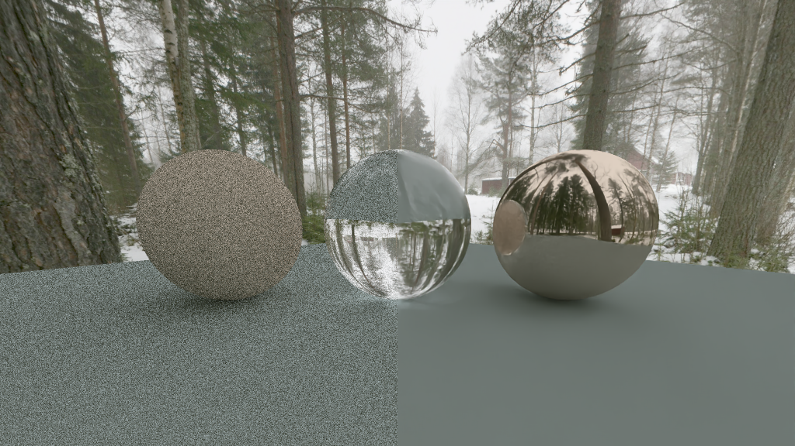

# reRender

---
> View This Page in [中文](https://github.com/GZhonghui/reRender/blob/master/readMe/readMe_CN.md)/[日本語](https://github.com/GZhonghui/reRender/blob/master/readMe/readMe_JP.md)  
> More Projects from the reFamily [**reSimulate**](https://github.com/GZhonghui/reSimulate)/[**reEngine**](https://github.com/GZhonghui/reEngine)

## About
**reRender** is an offline Render Engine

## Features
### ✔High Quality Result by Ray Tracing
### ✔BVH Acceleration
### ✔Multi-Threaded Acceleration
### ✔Multiple Materials
### ✔Import 3D Model
### ✔Render with Texture
### ✔Customize Skybox and Ambient Light

### ✔AI Denoise

### ✔Fluid Surface Reconstruction
### ✔Render Water
### ✔Signed Distance Field
### ✔2D Scene Support
### ✔Real-Time Result Preview
### ✔Easy to Use as Python Interface

## Credits
> This Project Depends on the Following Libs
* Assimp
* Boost
* Eigen
* Intel OIDN
* Intel TBB
* STB
