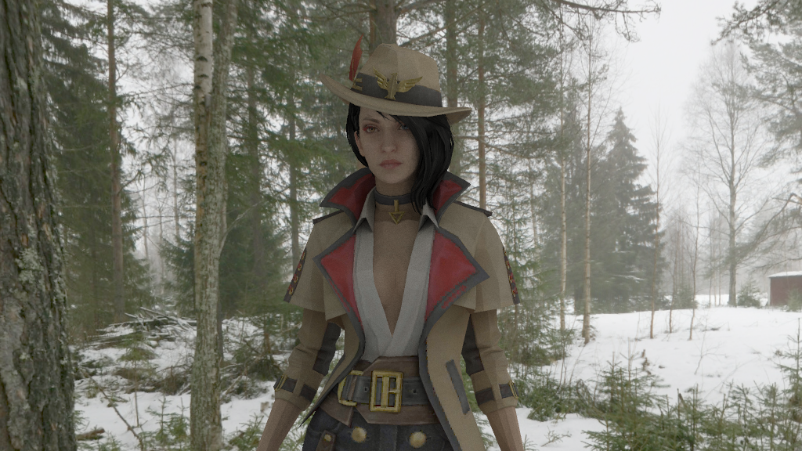
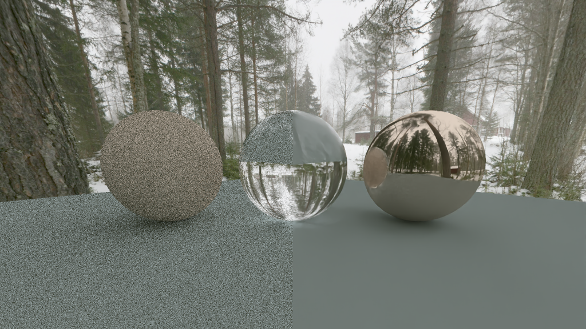
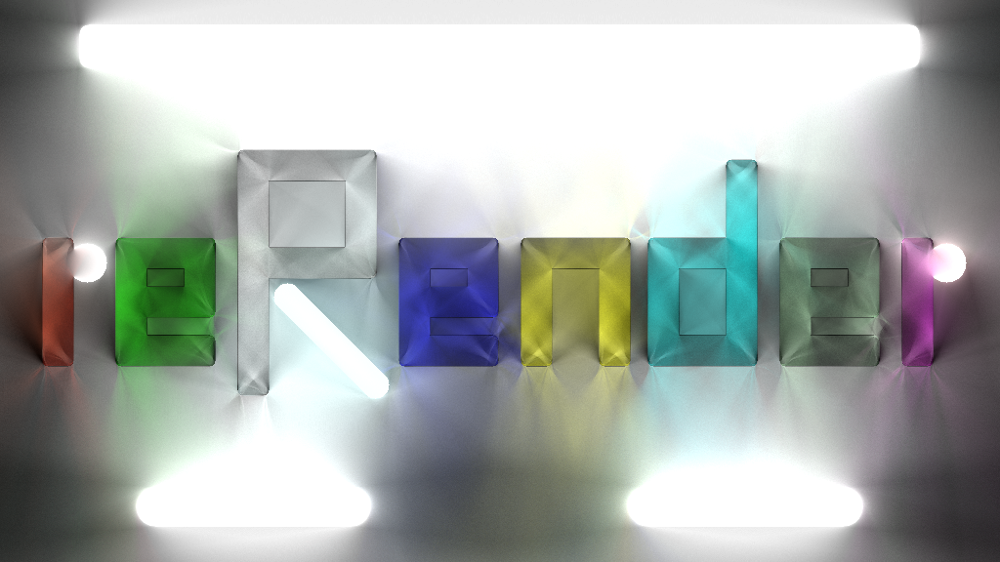

# reRender

---
> View This Page in [中文](readMe/readMe_CN.md)/[日本語](readMe/readMe_JP.md)  
> More Projects from the reFamily [**reSimulate**](https://github.com/GZhonghui/reSimulate)/[**reEngine**](https://github.com/GZhonghui/reEngine)

## About
**reRender** is an offline Render Engine

| Ray Tracing with Mesh/Texture/Skybox |
:-:
|  |
| AI Denoise |
|  |
| Render 2D Scene |
|  |

## Tutorial
**reRender** works as a Python Module
```python
from Render.Scene import StaticScene

def main():
    
    scene=StaticScene()

    scene.SetRenderConfig('spp',2)
    scene.SetRenderConfig('core',24)
    scene.SetRenderConfig('target_pos',(0,0,0))
    scene.SetRenderConfig('camera_pos',(10,-10,4))
    scene.SetRenderConfig('horizontal_angle',100)
    scene.SetRenderConfig('resolution',(1024,768))
    scene.SetRenderConfig('enableGammaCorrection',1)
    scene.SetRenderConfig('enableMSAA',1)

    scene.LoadFile('../../Asset/Sphere/Sphere.obj','Self')
    scene.LoadFile('../../Asset/Plane/Plane.obj','Standard')
    scene.LoadFile('../../Asset/Creek','Skybox')

    scene.SetRenderConfig('encode_path','../../Render.png')

    scene.Render()

    return None

if __name__=='__main__':
    main()
```

## Features
### ✔High Quality Result by Ray Tracing
### ✔BVH Acceleration
### ✔Multi-Threaded Acceleration
### ✔Multiple Materials
### ✔Import 3D Model
### ✔Render with Texture
### ✔Customize Skybox and Ambient Light
### ✔AI Denoise
### ✔Render Animation
### ✔Encode to Image or Video
### ✔Signed Distance Field
### ✔2D Scene Support
### ✔Real-Time Result Preview
### ✔Easy to Use as Python Interface

## Credits
> This Project Depends on the Following Libs
* Assimp
* Boost
* Eigen
* Intel OIDN
* Intel TBB
* NumPy
* OpenCV
* STB
