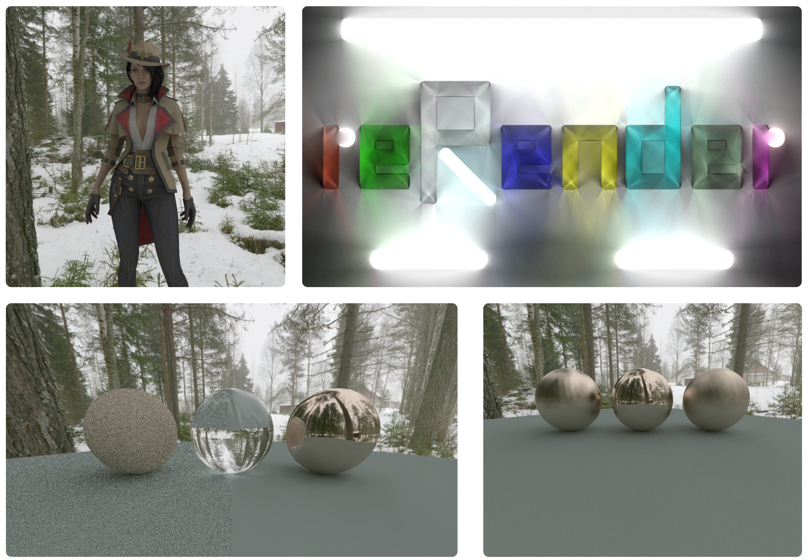

# reRender

---

> More Projects from the reFamily [**reSimulate**](https://github.com/GZhonghui/reSimulate)/[**reEngine**](https://github.com/GZhonghui/reEngine)

## About
**reRender** is an Offline Renderer based on Path Tracing, and it is my Undergraduate Final Project. It contains a Scene Editor as the client part and a Render Core as the server part. The Scene Editor is based on Qt and OpenGL and it can help users to create scenes visually. The Render Core is mainly based on the Path Tracing algorithm and it also supports Denoise. The client can deliver serialized scene data with instructions to multiple servers synchronously. It is also responsible for collecting and combining the final render result.

## Media




## Usage
### GUI
**Screenshot**  


**Workflow**  
[](https://www.youtube.com/watch?v=oG1NbnHYsMA)

### Python
**reRender** can also works as a Python Module.
```python
from Render.Scene import StaticScene

def main():
    
    scene=StaticScene()

    scene.SetRenderConfig('spp',2)
    scene.SetRenderConfig('core',24)
    scene.SetRenderConfig('target_pos',(0,0,0))
    scene.SetRenderConfig('camera_pos',(10,-10,4))
    scene.SetRenderConfig('horizontal_angle',100)
    scene.SetRenderConfig('resolution',(1024,768))
    scene.SetRenderConfig('enableGammaCorrection',1)
    scene.SetRenderConfig('enableMSAA',1)

    scene.LoadFile('../../Asset/Sphere/Sphere.obj','Self')
    scene.LoadFile('../../Asset/Plane/Plane.obj','Standard')
    scene.LoadFile('../../Asset/Creek','Skybox')

    scene.SetRenderConfig('encode_path','../../Render.png')

    scene.Render()

    return None

if __name__=='__main__':
    main()
```

## Features
- High Quality Result by Ray Tracing
- BVH Acceleration
- Multi-Threaded Acceleration
- Multiple Materials
- Import 3D Model
- Render with Texture
- Customize Skybox and Ambient Light
- AI Denoise
- Render Animation
- Encode to Image or Video
- Signed Distance Field
- 2D Scene Support
- Real-Time Result Preview
- Easy to Use as Python Interface

## Credits
> This Project Depends on the Following Libs
* Assimp
* Boost
* Eigen
* Intel OIDN
* Intel TBB
* NumPy
* OpenCV
* STB
