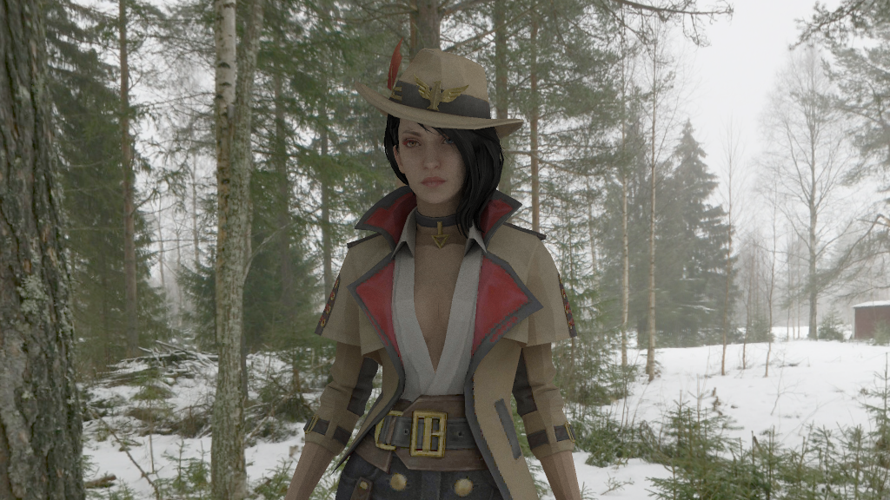

# reRender

---  
> More Projects from the reFamily [**reSimulate**](https://github.com/GZhonghui/reSimulate)/[**reEngine**](https://github.com/GZhonghui/reEngine)

## 关于
**reRender**是一个离线的渲染引擎

| 光线追踪 |
:-:
|  |
| AI降噪 |
|  |
| 渲染2D场景 |
|  |

## 使用
**reRender**是一个Python包
```python
from Render.Scene import StaticScene

def main():
    
    scene=StaticScene()

    scene.SetRenderConfig('spp',2)
    scene.SetRenderConfig('core',24)
    scene.SetRenderConfig('target_pos',(0,0,0))
    scene.SetRenderConfig('camera_pos',(10,-10,4))
    scene.SetRenderConfig('horizontal_angle',100)
    scene.SetRenderConfig('resolution',(1024,768))
    scene.SetRenderConfig('enableGammaCorrection',1)
    scene.SetRenderConfig('enableMSAA',1)

    scene.LoadFile('../../Asset/Sphere/Sphere.obj','Self')
    scene.LoadFile('../../Asset/Plane/Plane.obj','Standard')
    scene.LoadFile('../../Asset/Creek','Skybox')

    scene.SetRenderConfig('encode_path','../../Render.png')

    scene.Render()

    return None

if __name__=='__main__':
    main()
```

## 特性
### ✔光线追踪
### ✔BVH加速
### ✔多线程加速
### ✔多种材质
### ✔导入3D网格
### ✔渲染贴图
### ✔自定义天空盒或环境光
### ✔AI降噪
### ✔渲染动画
### ✔编码为图像或视频
### ✔Signed Distance Field
### ✔支持渲染2D场景
### ✔渲染结果实时预览
### ✔易用的Python接口

## 致谢
> 本项目依赖于以下的库
* Assimp
* Boost
* Eigen
* Intel OIDN
* Intel TBB
* NumPy
* OpenCV
* STB
