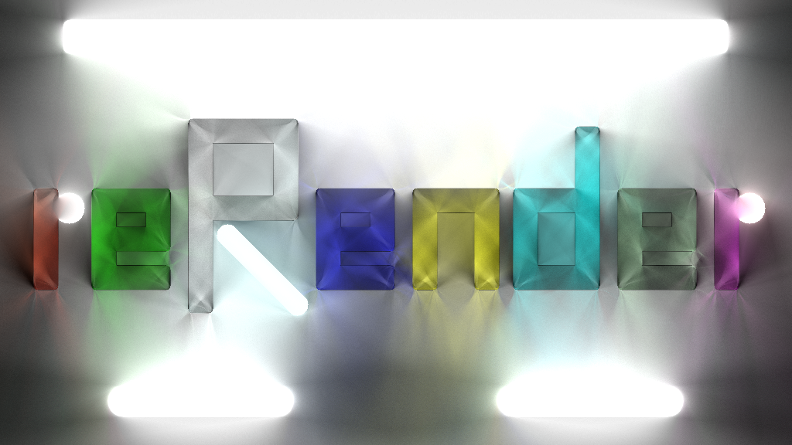

# reRender

---
> More Projects from the reFamily [**reSimulate**](https://github.com/GZhonghui/reSimulate)/[**reEngine**](https://github.com/GZhonghui/reEngine)

## 約
**reRender**はオフラインのレンダリングエンジンです

## 特徴
### ✔レイトレーシングによる高品質の結果
### ✔BVH加速
### ✔マルチスレッド加速
### ✔複数の素材
### ✔3Dモデルのインポート
### ✔テクスチャでレンダリング
### ✔スカイボックスとアンビエントライトをカスタマイズする

### ✔AIノイズ除去

### ✔アニメーションをレンダリングする
### ✔画像またはビデオにエンコードする
### ✔Signed Distance Field
### ✔2Dシーンのサポート

### ✔リアルタイムの結果プレビュー
### ✔Pythonインターフェースとして使いやすい

## クレジット
> このプロジェクトは以下のライブラリに依存しています
* Assimp
* Boost
* Eigen
* Intel OIDN
* Intel TBB
* NumPy
* OpenCV
* STB
